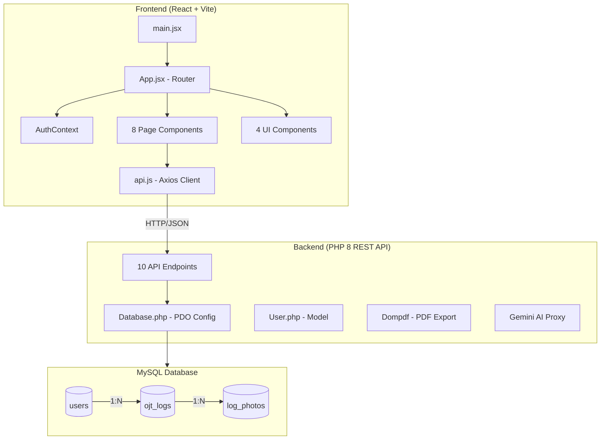
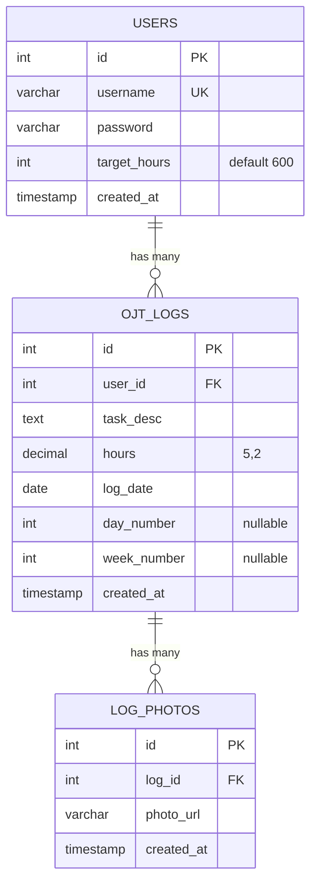

# 🔍 OJT Portal — Full System Analysis

> **Date:** March 12, 2026 | **Project:** `mobileojt` | **Live:** [palegoldenrod-stork-598963.hostingersite.com](https://palegoldenrod-stork-598963.hostingersite.com)

---

## 1. Architecture Overview



| Layer | Technology | Version |
|-------|-----------|---------|
| **Frontend** | React + Vite + Tailwind CSS | React 19, Vite 7, Tailwind 3 |
| **Backend** | PHP (REST API) | PHP 8 |
| **Database** | MySQL (PDO) | InnoDB / utf8mb4 |
| **PDF Export** | Dompdf | via Composer |
| **AI Integration** | Google Gemini (3-flash-preview) | `@google/generative-ai` ^0.24 |
| **Icons** | Lucide React + Material Symbols | v0.575 |
| **Hosting** | Hostinger | Production |
| **Local Dev** | XAMPP | `c:\xampp\htdocs\mobileojt` |

---

## 2. Project Structure

```
mobileojt/
├── index.html              ← Production entry (imports built assets)
├── database_schema.sql     ← Schema export
├── assets/                 ← Vite build output (JS + CSS bundles)
│
├── client/                 ← React Frontend
│   ├── src/
│   │   ├── main.jsx
│   │   ├── App.jsx         ← Router + PrivateRoute
│   │   ├── index.css       ← Global styles
│   │   ├── context/
│   │   │   └── AuthContext.jsx
│   │   ├── services/
│   │   │   └── api.js      ← Axios instance + interceptors
│   │   ├── pages/          ← 8 page components
│   │   │   ├── Dashboard.jsx   (10KB)
│   │   │   ├── LogDetail.jsx   (20KB) ← largest page
│   │   │   ├── LogInput.jsx    (13KB)
│   │   │   ├── Login.jsx       (6.7KB)
│   │   │   ├── Logs.jsx        (7.7KB)
│   │   │   ├── Profile.jsx     (5.2KB)
│   │   │   ├── Register.jsx    (9.5KB)
│   │   │   └── Stats.jsx       (10KB)
│   │   └── components/     ← 4 shared components
│   │       ├── AIChatWidget.jsx  (client-side Gemini)
│   │       ├── ChatWidget.jsx    (server-side Gemini proxy)
│   │       ├── BottomNav.jsx
│   │       └── Header.jsx
│   ├── .env.development    ← Local API URL
│   ├── .env.production     ← Hostinger API URL
│   ├── tailwind.config.js  ← Custom design system
│   └── vite.config.js
│
├── api/                    ← PHP Backend
│   ├── config/
│   │   └── Database.php    ← PDO connection (Hostinger creds)
│   ├── models/
│   │   └── User.php        ← Authentication model
│   ├── endpoints/          ← 10 REST endpoints
│   │   ├── login.php       ← POST auth
│   │   ├── register.php    ← POST create user
│   │   ├── create.php      ← POST create log (+ photo upload)
│   │   ├── read.php        ← GET logs + photos + summary
│   │   ├── update_log.php  ← POST update log (+ add/remove photos)
│   │   ├── delete.php      ← POST delete log
│   │   ├── update_target.php ← POST update target hours
│   │   ├── export_pdf.php  ← GET bulk PDF export
│   │   ├── export_single_pdf.php ← GET single log PDF
│   │   └── chat.php        ← POST Gemini AI proxy
│   ├── uploads/            ← Photo storage
│   └── vendor/             ← Composer (Dompdf)
│
├── stitch/                 ← UI prototypes (unused)
│   └── stitch/
│       ├── tactical_dashboard/
│       └── command_center_log_input/
│
└── docs/                   ← Planning docs
    ├── PLAN-gemini-api.md
    └── PLAN-ojt-web-app.md
```

---

## 3. Database Schema



> Both FKs use `ON DELETE CASCADE` — deleting a user removes all their logs and photos.

---

## 4. API Endpoints

| Endpoint | Method | Auth | Description |
|----------|--------|------|-------------|
| `/login.php` | POST | ❌ | Authenticate with username/password |
| `/register.php` | POST | ❌ | Create new user (bcrypt hashed) |
| `/create.php` | POST | user_id | Create log entry + upload photos |
| `/read.php` | GET | user_id | Fetch all logs with photos + summary |
| `/update_log.php` | POST | user_id | Update log + add/remove photos |
| `/delete.php` | POST | user_id | Delete a log entry |
| `/update_target.php` | POST | user_id | Update target training hours |
| `/export_pdf.php` | GET | user_id | Bulk PDF export (all logs) |
| `/export_single_pdf.php` | GET | user_id+log_id | Single log PDF with photos |
| `/chat.php` | POST | ❌ | Gemini AI proxy for task descriptions |

---

## 5. Frontend Routing

| Path | Component | Auth | Description |
|------|-----------|------|-------------|
| `/` | `Dashboard` | ✅ | Progress ring, metrics, recent logs |
| `/add` | `LogInput` | ✅ | Create new log entry with photos |
| `/logs` | `Logs` | ✅ | Log history with thumbnails |
| `/log/:id` | `LogDetail` | ✅ | Full log view + edit + lightbox |
| `/stats` | `Stats` | ✅ | Training analytics |
| `/profile` | `Profile` | ✅ | User info + settings |
| `/login` | `Login` | ❌ | Login page |
| `/register` | `Register` | ❌ | Registration page |

---

## 6. Design System

The app uses a **cyberpunk/tech-tactical** aesthetic with:

| Token | Value | Usage |
|-------|-------|-------|
| `primary` | `#00f2ff` (Cyan) | Accents, highlights, neon glows |
| `matrix-green` | `#00FF41` | Status indicators |
| `background-dark` | `#0B0E14` | Main dark background |
| `surface-dark` | `#162a2b` | Card/panel surfaces |
| Fonts | Rajdhani, Space Grotesk, Space Mono | Display, body, monospace |
| Effects | Neon box-shadows, pulse-glow, cursor-blink | Tactical feel |
| Pattern | SVG circuit-pattern background | Immersive overlay |

---

## 7. Key Features Working

- ✅ User registration with bcrypt password hashing
- ✅ Login with localStorage session persistence
- ✅ CRUD operations for OJT daily logs
- ✅ Multi-photo upload (JPEG, PNG, WebP, GIF) with drag & drop
- ✅ Photo management (add/remove per log entry)
- ✅ File validation (MIME type check, 5MB limit)
- ✅ Bulk PDF export (all logs as accomplishment report)
- ✅ Single log PDF export with embedded photos
- ✅ AI-powered task description generation (Gemini proxy)
- ✅ Auto day/week numbering with fallback logic
- ✅ Live progress tracking (total hours vs target)
- ✅ Responsive mobile-first design
- ✅ Protected routes via `PrivateRoute` component
- ✅ CORS enabled on all endpoints
- ✅ Manila timezone (`Asia/Manila`) on PHP + MySQL

---

## 8. Security Findings

> [!CAUTION]
> **Critical issues that should be addressed before production hardening.**

### 🔴 Critical

| # | Issue | Location | Risk |
|---|-------|----------|------|
| 1 | **Hardcoded DB credentials** | [Database.php](file:///c:/xampp/htdocs/mobileojt/api/config/Database.php#L4-L6) | Full database access if source exposed |
| 2 | **Gemini API key in source** | [.env.development](file:///c:/xampp/htdocs/mobileojt/client/.env.development#L2), [.env.production](file:///c:/xampp/htdocs/mobileojt/client/.env.production#L2), [chat.php](file:///c:/xampp/htdocs/mobileojt/api/endpoints/chat.php#L16) | API key exposed in client bundle AND server |
| 3 | **Wildcard CORS** (`Access-Control-Allow-Origin: *`) | All endpoints | Any domain can call your API |
| 4 | **No real authentication** | All endpoints | `user_id` passed as body param — any client can spoof any user |

### 🟡 Medium

| # | Issue | Location | Risk |
|---|-------|----------|------|
| 5 | **No rate limiting** | All endpoints | Brute force / DDoS vulnerability |
| 6 | **No CSRF protection** | All POST endpoints | Cross-site request forgery |
| 7 | **`die()` on missing params** | [read.php L16](file:///c:/xampp/htdocs/mobileojt/api/endpoints/read.php#L16), PDF exports | Exposes server internals |
| 8 | **No input length validation** | Registration, logs | Potential buffer/storage abuse |
| 9 | **`extract()` usage** | [read.php L63](file:///c:/xampp/htdocs/mobileojt/api/endpoints/read.php#L63) | Variable injection risk |

### 🟢 Low / Informational

| # | Issue | Notes |
|---|-------|-------|
| 10 | Viewport `user-scalable=no` | Accessibility concern — users can't zoom |
| 11 | OG URL points to `localhost:5173` | Should be production URL |
| 12 | Debug files in production | `ai_debug.log`, `debug_output.txt`, test PHP files |
| 13 | `stitch/` directory | Unused prototypes in production |

---

## 9. Architecture Observations

### Strengths
- **Clean separation** — Frontend (React SPA) and Backend (PHP REST) are independent
- **Smart auto-numbering** — Day/week auto-calculation with manual override
- **Photo abstraction** — Separate `log_photos` table with proper FK cascading
- **Dual content type support** — Endpoints handle both JSON and multipart/form-data
- **AI integration** — Clever use of Gemini as a Tagalog-to-English task description translator

### Potential Improvements

| Area | Current State | Recommendation |
|------|--------------|----------------|
| **Auth** | localStorage user object, `user_id` in body | JWT tokens with server-side session validation |
| **API Structure** | File-per-endpoint, boilerplate CORS headers | Router/middleware pattern (e.g., Slim Framework) |
| **Error Handling** | `die()`, mixed HTTP codes | Consistent error envelope with error codes |
| **Validation** | Basic `!empty()` checks | Input validation library / schema validation |
| **Testing** | No tests found | Unit tests for API, component tests for React |
| **Build Process** | Manual build + copy to root | CI/CD pipeline with Hostinger deployment |
| **Environment** | DB creds hardcoded in PHP class | Environment variables / `.env` file for PHP |
| **Chat Features** | Two chat widgets (client-side + server-side) | Consolidate to one (server-side proxy recommended) |

---

## 10. File Size Analysis

| Component | Files | Total Size | Largest File |
|-----------|-------|-----------|-------------|
| **Pages** | 8 | ~84 KB | `LogDetail.jsx` (20.6 KB) |
| **Components** | 4 | ~17 KB | `AIChatWidget.jsx` (6.2 KB) |
| **API Endpoints** | 10 | ~33 KB | `update_log.php` (5.8 KB) |
| **Built Bundle** | 2 | ~377 KB | `index-gC_XnNf6.js` (337 KB) |

> [!NOTE]
> The 337KB JavaScript bundle is reasonable for a React app with router, icons, and AI SDK. Consider code-splitting for larger future iterations.

---

## Summary

The OJT Portal is a well-structured personal training tracker with a **cyberpunk-themed React frontend**, **PHP REST API backend**, and **AI-powered task description generation**. The core CRUD, photo management, and PDF export features are all functional.

**Priority improvements:** Address the security issues (especially hardcoded credentials and lack of real auth), consolidate the dual chat widgets, add error boundaries, and consider server-side session management for production hardening.
